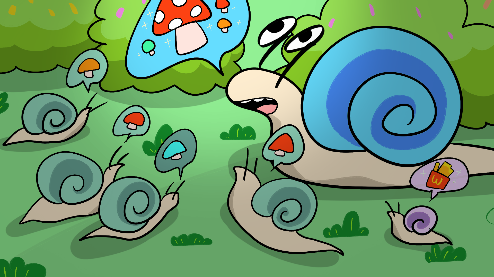

<!-- In this two-player asymmetric RTS game, players control Mushroom and Snail as two opposing species that aim to destroy each other in an enclosed natural environment with limited resources. Each side has unique abilities and tools to help it achieve dominance over the other.

This game was jointly developed by Xiaoyu Liu, <a href="https://yanmeeei.github.io/portfolio/">Yanmei Wang</a>, <a href="https://yushi111.github.io/">Yushi She</a>, and me. I implemented buildings, the spit skill, the growth algorithm, the vitality system, and the skill selection mechanism.

 -->

