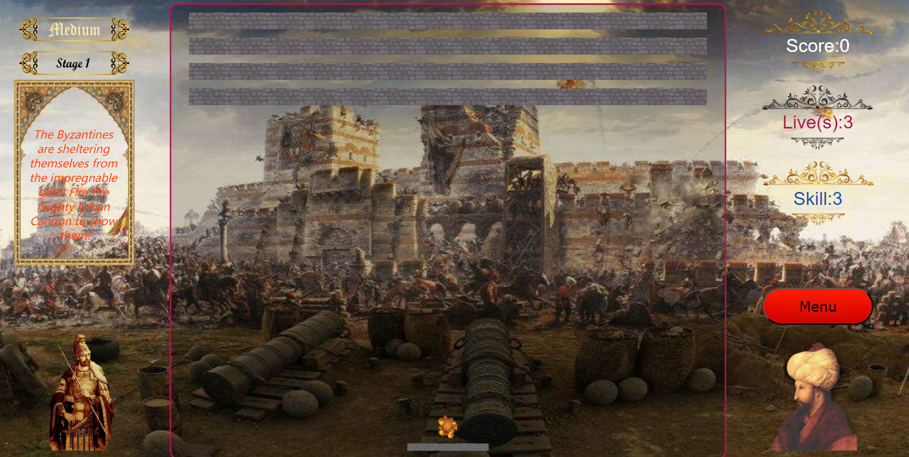

In the spring of 1453, hundreds of thousands of Ottoman soldiers under the command of Mehmed II were besieging Constantinople, the last bastion of Byzantines. Victory seemed to be within reach, but the impregnable gate of Constantinople held the Ottomans back and left them daunted.

